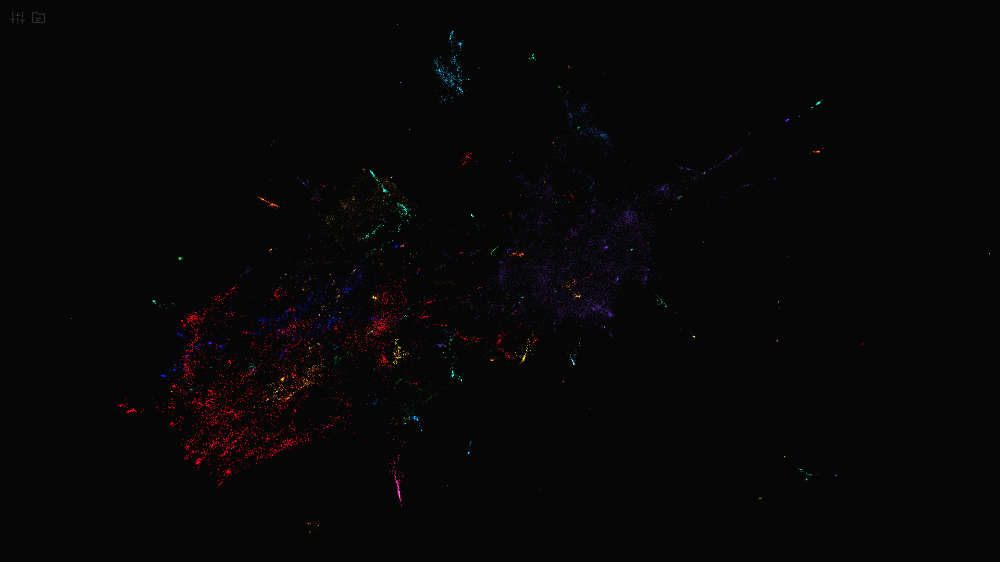
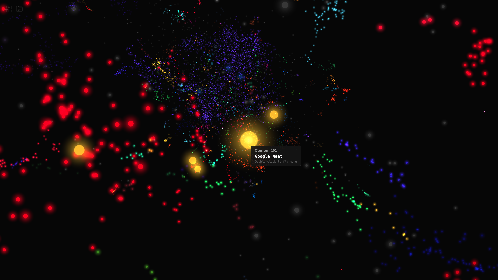
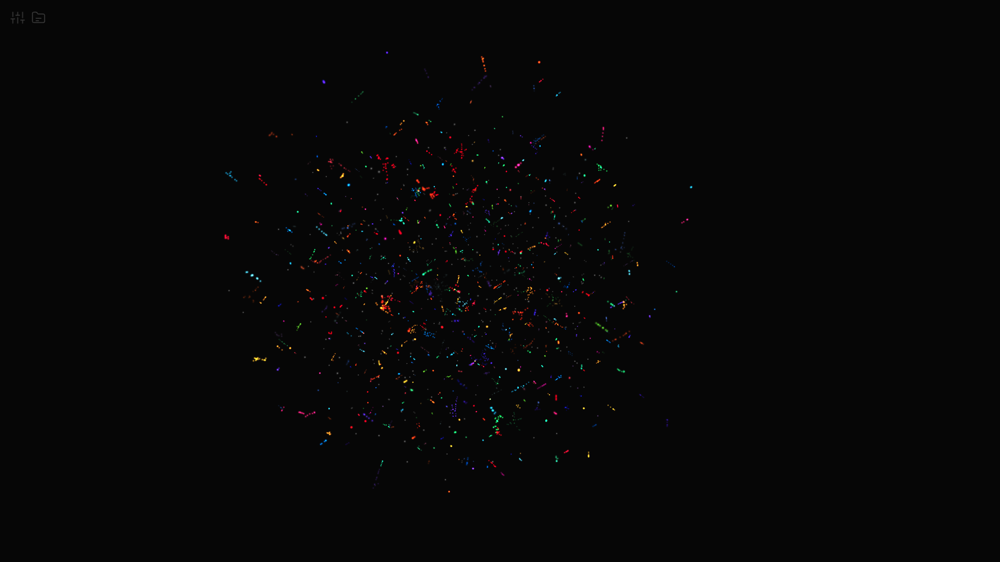
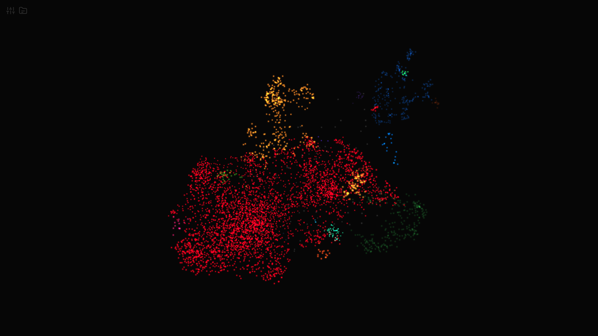

# [Trace](https://trace-app.net) 

A full-stack, real-time 3D visualization dashboard that converts your Google Chrome browsing history into an interactive, semantic galaxy using text embeddings and UMAP dimensionality reduction.

## Showcase

<!-- <video src="./readme_assets/trace_demo.mp4" autoplay loop muted playsinline></video> -->

<em>Trace Galaxy Demo</em>

<em>3D map with over 30,000 nodes</em>

<em>Highlighted node information</em>

## Motivation
Trace was built around the idea of discovering unintuitive patterns in our daily lives. While a normal scroll through your search history may seem like a linear, jumbled mess of ideas, Trace allows you to visualize your digital journey as colorful clusters in 3D space. 

This project allows users to visually identify research rabbit holes, recurring interests, and the structural map of their digital footprint.

## Usage
This visualization is made possible by [Google Takeout](https://takeout.google.com/), which allows you to download a complete copy of your local browsing history. 

**How to export your data:**
1. Go to **[Google Takeout](https://takeout.google.com/)**.
2. Click **"Deselect all"**.
3. Scroll down to **Chrome**.
4. Click **"All Chrome data included"**.
5. Click **"Deselect all"** again, then select **"History"**.
6. Scroll to the bottom and click **"Next Step"**.
7. Choose your preferred export settings and click **"Export"**.
8. Download and extract the `.zip` file. 
9. Locate the `History.json` file—this is what you will upload to Trace.

Once you have your `History.json` ready, go to **[Trace](https://trace-app.net)** and upload the file.

> **Privacy First:** Trace is 100% private. It uses your local browser storage and the backend server's RAM to process your data. Trace will NEVER record, store, or sell your data.

*Note: Processing your data will take some time. A 60MB file will take approximately 5 minutes to calculate the embeddings and load the visualization.*

## Movement Controls

Once you have uploaded and rendered a graph, you can traverse the digital landscape using the following controls:

| Action | Result |
| :--- | :--- |
| **Left-Click + Drag** | Rotates the camera |
| **Right-Click + Drag** | Pans the camera along the plane |
| **Scroll Wheel** | Zooms the camera in and out |
| **Double Left-Click (On a Node)** | Centers the camera on the selected node |
| **Double Left-Click (In Space)** | Moves the camera forward in the direction of view |
| **Scroll Wheel Click (On a Node)** | Opens the historical link in a new tab |
| **Ctrl/Cmd + Left-Click** | Opens the historical link in a new tab |

## Parameter Tuning

Because everyone's browsing history is completely unique in density and scope, one set of mathematical parameters will not work for all datasets. Open the settings menu (top left) to fine-tune your graph:

### Galaxy Controls
* **Node Count:** Controls the maximum number of unique nodes rendered.
* **Topic Broadness:** Determines the specificity of relationships. Low values focus on local, tight relationships; high values look at the broader, overarching structure.
* **Repulsion Factor:** Controls the density of the galaxy. Low values result in dense, tight clumps, while higher values spread the nodes out.
* **Random Seed:** The default is `-1` (entirely random), but a specific integer can be set to generate reproducible results.

### Cluster Settings
* **Cluster Radius:** The maximum distance between two nodes for them to be considered part of the same semantic cluster.
* **Minimum Cluster Size:** The minimum amount of closely packed nodes required to spawn a brand new cluster.

### Visual Aesthetics
* **Node Size:** Controls the visual size of the clickable node.
* **Glow Intensity:** Controls the size and intensity of the neon bloom (note: this may make nodes appear larger than their actual hitbox).
* **Brightness:** Adjusts the global scene brightness.
* **Galaxy Scale:** Controls the visual scale and spread of the galaxy without altering the underlying mathematical relationships.

### Examples

<em>Sparse Nodes</em>

<em>Dense Cluster</em>

## Roadmap & Future Updates
There are several exciting features planned for future releases to make this tool faster, smarter, and more accessible.

### Short-Term Enhancements (UI/UX)
* **Cluster Labeling:** Utilize NLP to automatically generate an overarching name/theme for each cluster.
* **Temporal Filtering:** Add a timeline slider to filter the rendered galaxy by specific dates, months, or years, allowing users to watch their interests evolve over time.

### Long-Term Goals (Backend Improvements)
* **Compute Optimization:** Upgrade backend host infrastructure and optimize the data pipeline for faster processing of large files.
* **Enhanced Data Security:** Transition sensitive data from system memory (RAM) to encrypted, ephemeral SSD storage to optimize server capacity while guaranteeing privacy.
* **Multi-Browser Support:** Expand data ingestion pipelines to natively support Safari, Firefox, and Arc browser history exports.

## Attributions & License
This project is open-source and licensed under the **AGPL-3.0 License**.

* **Frontend Engine:** Built with [Vite](https://vitejs.dev/) and [Three.js](https://threejs.org/) (MIT License). Hosted on [Vercel](https://vercel.com/home).
* **Backend Engine:** Powered by [FastAPI](https://fastapi.tiangolo.com/) and [Uvicorn](https://www.uvicorn.org/) (MIT License). Hosted on [DigitalOcean Droplets](https://www.digitalocean.com/) with [Nginx](https://nginx.org/) reverse proxy and [Let's Encrypt SSL](https://letsencrypt.org/).
* **Dimensionality Reduction:** Powered by [UMAP‑learn](https://umap-learn.readthedocs.io/) (BSD 3-Clause License).
* **Natural Language Processing:** Sentence embeddings via [Hugging Face Transformers](https://huggingface.co/transformers/) and [Sentence-Transformers](https://www.sbert.net/) (Apache 2.0).

## Developer Profile
**Built by Blair Qiao** | *University of Texas at Austin*
* **GitHub:** [@Blairqiao](https://github.com/Blairqiao)
* **Contact:** yanzhe.qiao.1@gmail.com